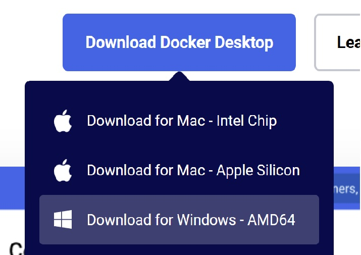

# Installation Guide: AlmaLinux 9 on Docker

## Introduction

This guide explains what Docker is, why it is useful, and how to install and run AlmaLinux 9 inside a Docker container on Windows

## What is Docker and Why we use it?
Docker is a containerization platform that allows you to run applications or entire operating systems in an isolated environment called a container. Unlike virtual machines, containers share the host OS kernel, making them lighter, faster, and more efficient.

## STEP 1: Install Docker
First we have to check if WSL 2 is enabled, WSL 2 (Windows Subsystem for Linux 2) is a feature in Windows 10 and Windows 11 that allows you to run a full Linux environment directly inside Windows without using a virtual machine. We use Power Shell (or any other terminal is good):
1.  Check if WSL 2 is enabled by running: `wsl --list --verbose`  
 If note installed, run: `wsl --install`  
 Then restart your computer.
2. Download and Install Docker Desktop from https://www.Docker.com
   
3. Enable WSL 2 Beckend during installation
4. Verify installation by running:  
   `docker --version`  
   `docker run hello-world`  
   If you see "Hello from Docker!", installation is successful!

## **Step 2: Download and Run AlmaLinux 9**
AlmaLinux is a free and open-source operating system that is binary-compatible with Red Hat Enterprise Linux (RHEL). It is commonly used for servers and enterprise environments.

### **Why Use AlmaLinux in Docker?**
AlmaLinux in Docker provides a lightweight, portable, and consistent environment for testing, development, and deployment. Running AlmaLinux in a container eliminates the need for a full installation on the host system while ensuring a controlled and isolated environment. This makes it ideal for safely testing applications, experimenting with configurations, and ensuring uniformity across different systems, making deployments more predictable and efficient.

To run AlmaLinux in Docker, follow these steps:

1. **Pull the AlmaLinux 9 image from Docker Hub:**
   ```sh
   docker pull almalinux:9
   ```

2. **Start a new container with AlmaLinux 9:**
   ```sh
   docker run -it almalinux:9 /bin/bash
   ```
   - The `-it` flag ensures an interactive session.
   - `/bin/bash` starts a bash shell inside the container.

3. **Verify the installation inside the container:**
   ```sh
   cat /etc/os-release
   ```
   You should see output confirming that you are running AlmaLinux.

---

## **Step 3: Manage Docker Containers**
Containers are temporary by nature, but Docker allows you to manage them efficiently.

### **Useful Docker Commands**
- **Exit the container:**
  ```sh
  exit
  ```
  This stops the container but does not remove it.

- **List running containers:**
  ```sh
  docker ps
  ```

- **List all containers (including stopped ones):**
  ```sh
  docker ps -a
  ```

- **Restart an existing container:**
  ```sh
  docker start -ai <container-ID>
  ```
  Replace `<container-ID>` with the actual ID shown in `docker ps -a`.

- **Remove a container:**
  ```sh
  docker rm <container-ID>
  ```
  This permanently deletes a container.


